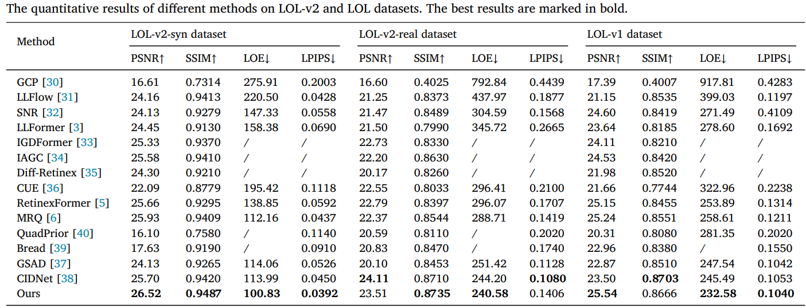
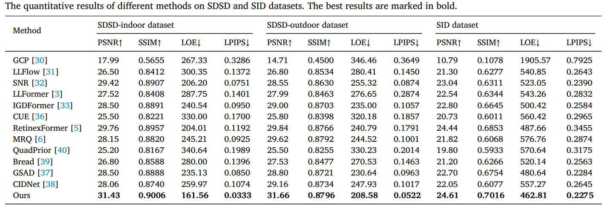
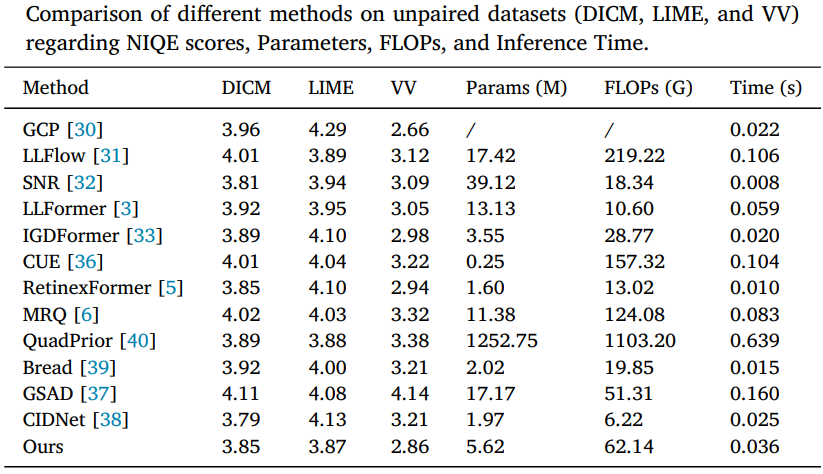
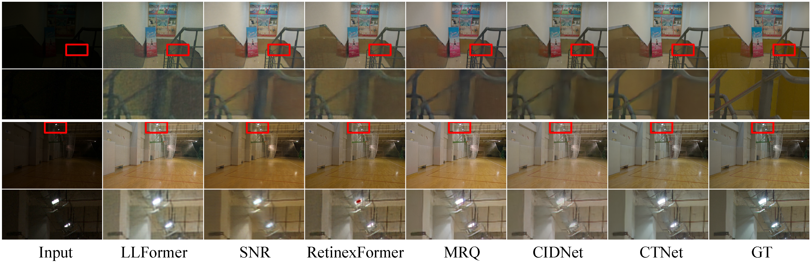
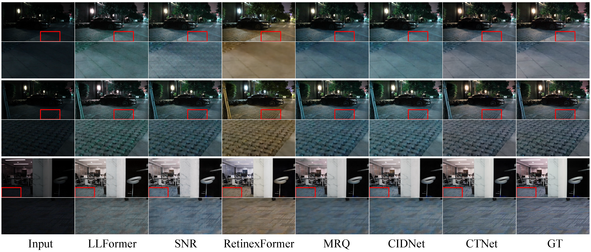
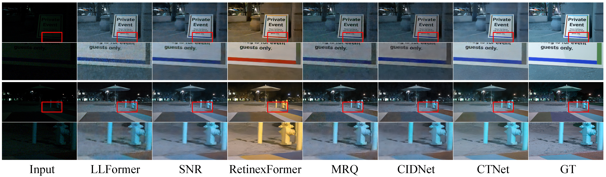

# CTNet: Color Transformation Network for Low-light Image Enhancement

This is the official PyTorch code for the paper "[[CTNet: Color Transformation Network for Low-light Image Enhancement]](https://www.sciencedirect.com/science/article/abs/pii/S0031320325010210)". This paper was published in Pattern Recognition.

#### 

> **Abstract:** Low-light images are often plagued by low visibility, poor contrast, and high noise levels, which significantly impair both subjective visual quality and the performance of downstream tasks. Existing enhancement methods typically struggle with color-related degradations such as color casting, artifacts, and distortion. To address these challenges, we propose an end-to-end Color Transformation Network for low-light image enhancement, with a specific focus on improving color restoration. By leveraging the complementary strengths of the HSV and RGB color spaces in capturing color attributes, our approach enables effective interaction between these color spaces at the feature level. The HSV branch simultaneously enhances the V component while extracting features from the H and S components, thereby providing a more comprehensive set of cues for color recovery. To facilitate interaction, we design a learnable Color Transformation Block that bridges the HSV and RGB feature domains, effectively simulating the HSV-to-RGB conversion. Furthermore, a Cross-Integration Block, employing an attention-based cross-guidance mechanism, enables bi-directional information flow between the two color spaces. Extensive experiments on both real and synthetic datasets demonstrate that our method achieves superior performance, surpassing existing approaches both qualitatively and quantitatively.


## Contents

- [x] [Datasets](https://github.com/NJUPT-IPR-XuLintao/UPT-Flow/blob/main/README.md#-datasets)
- [ ] Training
- [x] [Testing](https://github.com/NJUPT-IPR-XuLintao/UPT-Flow/blob/main/README.md#-testing)
- [x] [Results](https://github.com/NJUPT-IPR-XuLintao/UPT-Flow/blob/main/README.md#-results)
- [x] [Acknowledgements](https://github.com/NJUPT-IPR-XuLintao/UPT-Flow/blob/main/README.md#-acknowledgements)

## 1.Datasets

1、LOLv2 (real & synthetic): Wenhan Yang, Haofeng Huang, Wenjing Wang, Shiqi Wang, and Jiaying Liu. "Sparse Gradient Regularized Deep Retinex Network for Robust Low-Light Image Enhancement", TIP, 2021. [[Baiduyun (extracted code: l9xm)]](https://pan.baidu.com/s/1U9ePTfeLlnEbr5dtI1tm5g) [Google Drive](https://drive.google.com/file/d/1dzuLCk9_gE2bFF222n3-7GVUlSVHpMYC/view?usp=sharing) 

2、SMID and SDSD (indoor & outdoor): Please refer to [SNRNet(CVPR2022)](https://github.com/dvlab-research/SNR-Aware-Low-Light-Enhance)

## 2.Create Environment
1、Python 3.10.12  
2、Pytorch 2.6.0

## 3.Testing

**All the results for 5 datasets can be obtained from [Baidu Netdisk](https://pan.baidu.com/s/1HaQ059zBKmieowWSWOXtlg?pwd=bssk)**

Testing with images   
```python
# LOL
python test/LOL_img_test.py

# LOL-v2-real
python test/real_img_test.py

# LOL-v2-syn
python test/syn_img_test.py

# SDSD
python test/SDSD_img_test.py

# SID
python test/SID_img_test.py
```

Testing with pre-trained models  
```python
# LOL
python test/LOL_test.py

# LOL-v2-real
python test/real_test.py

# LOL-v2-syn
python test/syn_test.py

# SDSD
python test/SDSD_test.py

# SID
python test/SID_test.py

# unpair
python test/unpair_test.py 
```


## 4.Results

<details>
<summary>Quantitative Comparison (click to expan)</summary>


  <p align="center">
  
	</p>

  <p align="center">
  
	</p>
	
  <p align="center">
  
  </details>

<details>
<summary>Visual Comparison (click to expan)</summary>


  <p align="center">
  
	</p>

  <p align="center">
  
	</p>

  <p align="center">
  
	</p>
 
  </details>

## 5.Contact

If you have any questions, please feel free to contact me via email at xielidong@buaa.edu.cn.

## 6.Citation
If you find our work useful for your research, please cite our paper
```
@article{XIE2026112360,
title = {CTNet: Color transformation network for low-light image enhancement},
journal = {Pattern Recognition},
volume = {172},
pages = {112360},
year = {2026},
issn = {0031-3203},
doi = {https://doi.org/10.1016/j.patcog.2025.112360},
url = {https://www.sciencedirect.com/science/article/pii/S0031320325010210},
author = {Lidong Xie and Runmin Cong and Ju Dai and Wenhan Yang and Junjun Pan and Hao Wu},
}
```

## 7.Acknowledgements
The codes are based on [RetinexFormer](https://github.com/caiyuanhao1998/Retinexformer), [Restormer](https://github.com/swz30/Restormer), and [Uformer](https://github.com/ZhendongWang6/Uformer). Please also follow their licenses. Thanks for their awesome works.


